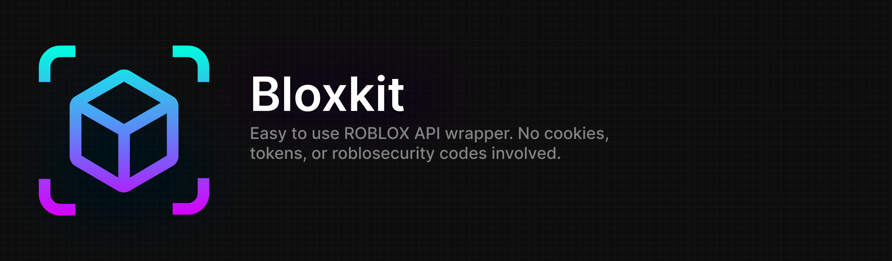

# 

Bloxkit is a ROBLOX api wrapper. As of now this package does not have authentication, so you cannot use this to block people, view your friend requests, and other endpoints. This package is still in it's beta stage so please bare with me. Contributions are welcomed.

### Installation

Using Npm:

```sh
npm i bloxkit
```

Using Yarn:

```sh
yarn add bloxkit
```

### Example Usage

<<<<<<< HEAD
> Bloxkit functions must be wrapped with `await`

```js
import { UserSearch } from '../index.js';

let results = await UserSearch('bloxkit');
console.log(results);
=======
```js
import { UserSearch } from '../index.js';
console.log(await UserSearch('r6nted'));
>>>>>>> 382512ed34cf41e4c7541563f393532a5cf7b376
```

### Docs

Check out the docs [here](./docs/)

#### Docs Guide

- <u><b>?</b></u>: optional parameter
- <u><b>!</b></u>: reccomended parameter
